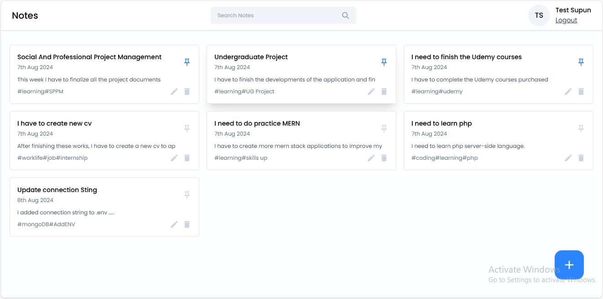
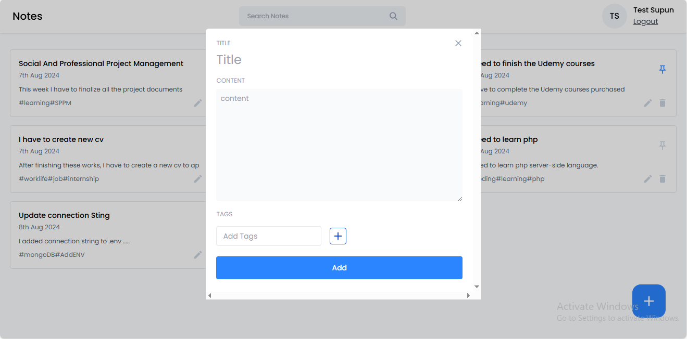
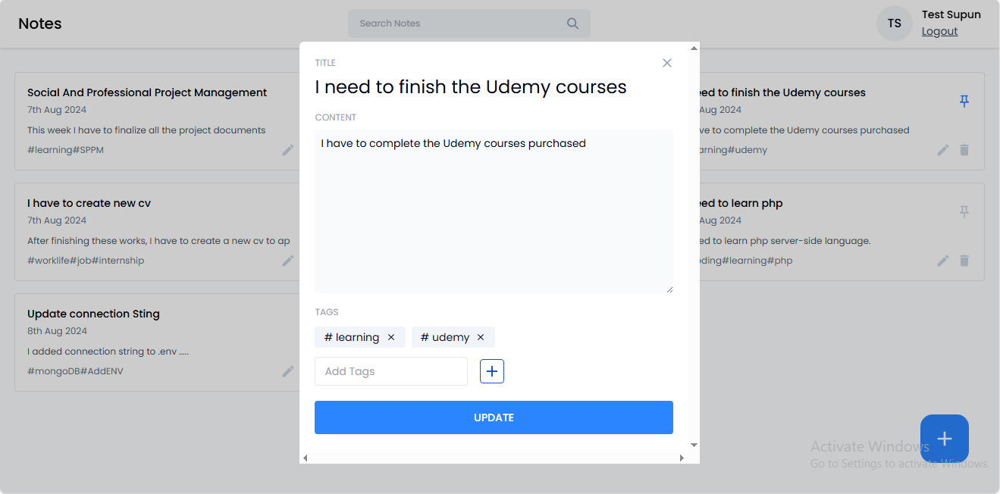
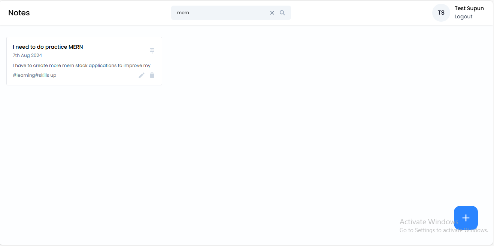

# React + Vite Notes app

> This is a note application which can Add, View, Edit, Delete and Search Notes. this is a mern stack project and i used mongodb atlas database. for styling i used tailwindcss.

> I have attached some of the images of this application.

> Home
> 

> Add Note
> 

> Update Note
> 

> Search Note
> 

> Search item not found
> 
